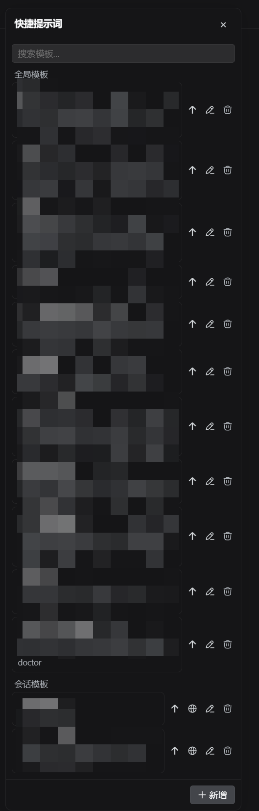

# @nelsonlongxiang/dsh-prompt-templates

English | [中文](README_zh.md)

[](https://www.npmjs.com/package/@nelsonlongxiang/dsh-prompt-templates)

Quick prompt templates for [DeepSeek Harness](https://github.com/deepseek-ai/deepseek-harness): global and per-session templates, a right-side browser panel, and pure-TS SQLite persistence via `node:sqlite` — one self-contained plugin, installable with `dsh plugin`.



## Install

```sh
dsh plugin --profile web add @nelsonlongxiang/dsh-prompt-templates
```

Restart `dsh web`, then look for the templates button in the composer tool row.

No Python toolchain required — since 0.3.0 the host half persists templates through `node:sqlite` (Node ≥ 24) directly inside the host process, reading and writing the same `$DSH_HOME/ext/prompt-templates/db.sqlite3` the former Python child owned (zero data migration).

## What you get

- **Global + per-session templates** — globals apply everywhere; session templates stay private to one conversation and can be promoted to global in one click
- **Insert or send** — one click appends the template into the draft; send-now dispatches immediately; edit, delete, and make-global all live in the row
- **Search & scroll** — filter the list as you type, reliable scrolling for long collections
- **Drag to reposition, double-click to reset** — the panel remembers where you put it
- **Durable by design** — templates persist in SQLite through a pure-TS store (`node:sqlite`) owned by the host plugin and closed with its lifecycle

## How it works

```text
src/                  TypeScript plugin (host half + browser half)
  index.ts            Host: owns the TS store, exposes the HTTP routes
  store.ts            Pure-TS template store over node:sqlite
  client/             Browser: panel UI registered into shell.overlay and
                      conversation.input.right
cordis.patch.yml      Bundle patch: mounts the plugin row
```

The store is pure TS inside the host half; no child process is spawned.

## Security

- Template content reaches a model request only as ordinary user text the user chose to insert — no automatic injection into any prompt
- The panel talks to the host store over the Host's plugin routes only; no extra listener, no outbound network

## Database sync CLI

The package ships a deterministic, local-only CLI for comparing and merging prompt-template databases across DSH homes. It never writes a remote database directly.

```sh
# Export a schema-v2 snapshot (canonical order + data_sha256)
dsh-prompt-templates export --db /path/to/db.sqlite3 --out snapshot.json --output=json

# Compare two snapshots (exit 1 with --fail-on-diff)
dsh-prompt-templates diff left.json right.json --output=json --fail-on-diff

# Merge into a JSON artifact only; equal-time or name conflicts block by default
dsh-prompt-templates merge base.json incoming.json --strategy newer --out merged.json --output=json

# Dry-run import (the default): review summary_sha256 and database hash
dsh-prompt-templates import --db /path/to/db.sqlite3 --in merged.json --output=json

# Apply only after binding both reviewed values; creates a backup, then one transaction
dsh-prompt-templates import --db /path/to/db.sqlite3 --in merged.json --apply \
  --expect-db-sha256 <db-sha256> --confirm-summary-hash <dry-run-summary-sha256> --output=json
```

`import` inserts/updates by template id and never prunes rows. It rejects unknown snapshot fields, unsupported schemas, mismatched hashes, same-name/different-id conflicts, and changes above `--max-changes` (default 100).

## Development

```sh
pnpm install
pnpm verify            # typecheck
pnpm build             # tsc host + tsc client + tsdown browser bundle
```

## Known limitations

- **Insert is caret-aware** — clicking a template replaces the current selection or inserts at the caret
- **Session templates need a current session** — with no session open, only global templates are reachable

## License

MIT
