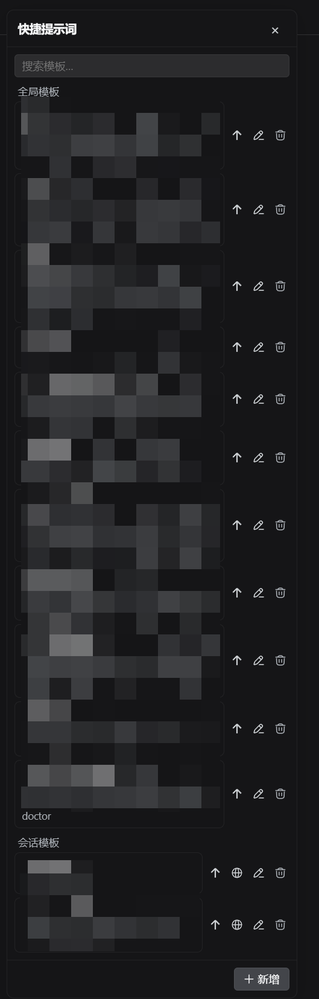

# @nelsonlongxiang/dsh-prompt-templates

[English](README.md) | 中文

[](https://www.npmjs.com/package/@nelsonlongxiang/dsh-prompt-templates)

[DeepSeek Harness](https://github.com/deepseek-ai/deepseek-harness) 快捷提示词模板：全局与会话级模板、右侧浏览器面板、Python 后端的 SQLite 持久化——一个自包含插件，`dsh plugin` 即装。



## 安装

```sh
dsh plugin --profile web add @nelsonlongxiang/dsh-prompt-templates
```

重启 `dsh web`，在输入框工具行找到模板按钮。

**需要 PATH 上有 `uv`**——安装时用 `uv sync` 建包内 Python venv；缺失的机器会大声报错并给出一行修复指引，而不是装出坏插件。插件组合在标准 webserver 行旁，Python 子进程从该 venv 拉起。

## 你能得到什么

- **全局 + 会话模板**——全局处处生效；会话模板只属于当前对话，一键提升为全局
- **插入或直发**——一键追加进草稿；send-now 立即发送；编辑、删除、转全局都在行内
- **搜索与滚动**——边输入边过滤，长列表滚动可靠
- **拖拽定位、双击复位**——面板记住你放的位置
- **设计即持久**——模板经 Python 后端存 SQLite，Host 以受管子进程接入（换行分隔 JSON-RPC）；子进程惰性拉起、随插件卸载回收

## 工作原理

```text
src/                  TypeScript 插件（host 面 + 浏览器面）
  index.ts            Host：拉起 Python 子进程，暴露 HTTP 路由
  client/             浏览器：面板 UI 注册进 shell.overlay 与
                      conversation.input.right
python/               Python 后端包（仅模板领域）
  src/dsh_prompt_templates/
  pyproject.toml      models、store、JSON-RPC server、CLI
cordis.patch.yml      Bundle patch：挂插件行
```

Python 包只承载模板领域，从共享扩展后端剥离而来，保持插件最小自包含。

## 安全

- 模板内容只有经用户主动插入才作为普通用户文本进入模型请求——绝不自动注入任何提示词
- 面板仅经 Host 的插件路由访问 Python 后端；无额外监听、无外联网络

## 开发

```sh
pnpm install
pnpm verify            # typecheck + Python 后端测试（uv --group test）
pnpm build             # tsc host + tsc client + tsdown 浏览器 bundle
node scripts/bootstrap.mjs   # uv sync 包内 venv
```

## 已知限制

- **插入是追加到草稿**——光标位置插入暂缓
- **会话模板需要当前会话**——无会话打开时只能用全局模板

## 许可证

MIT
